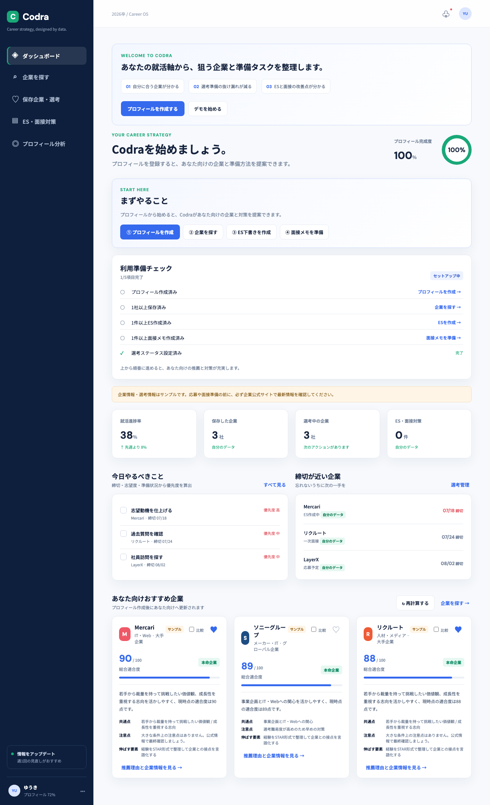
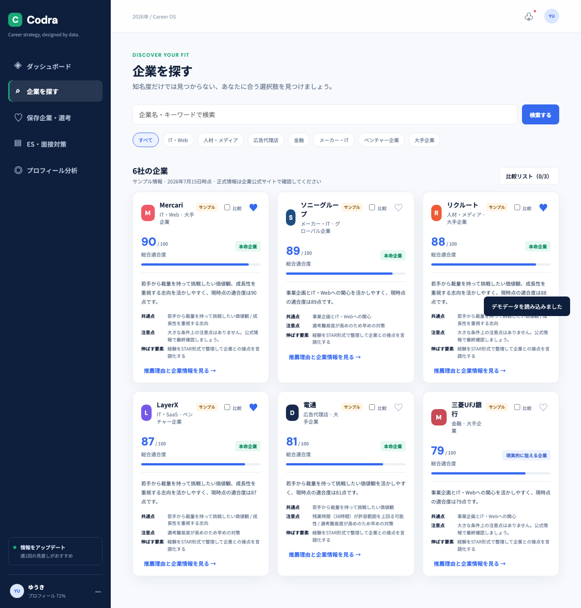
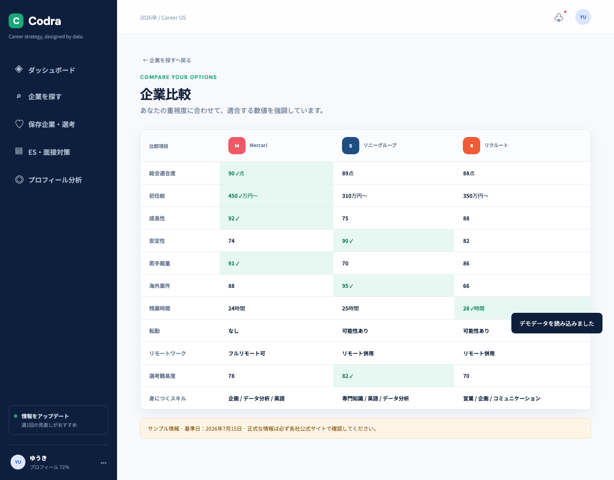

# Codra

Code / Career / Data / Strategy を一つにした、就活生向けのキャリア戦略プラットフォームMVPです。

プロフィールの希望条件・価値観・経験をもとに企業との相性を整理し、企業比較、選考管理、ES、面接対策までを一つの画面で進められます。

## 3分で試す

```bash
npm install
python3 -m http.server 4173
```

ブラウザで [http://localhost:4173](http://localhost:4173) を開きます。

1. 初回画面で「デモを始める」を選択
2. ダッシュボードのおすすめ企業を確認
3. 「企業を探す」で比較対象を最大3社まで追加
4. 「ES・面接対策」で下書きと面接メモを確認

デモを使わずに始める場合は、「プロフィールを作成する」から3ステップのオンボーディングへ進みます。

## デモモードでできること

「デモを始める」を押すと、以下のサンプルデータがブラウザへ投入されます。

- プロフィール
- 保存企業3社
- 選考状況3件
- ES下書き2件
- 面接メモ2件
- AI改善結果
- 企業研究メモ

デモデータには `isDemo: true` が付きます。既存データがある場合は上書き確認を表示し、プロフィール画面のデータ管理からデモデータだけ削除できます。

## 主な機能

- パーソナライズ企業推薦：業界、職種、働き方、成長性、安定性、若手裁量、海外志向などから適合度を計算
- 企業検索・保存・比較：最大3社を並べ、ユーザーに合う項目を強調
- 選考管理：ステータス、締切、次のアクション、優先度を管理
- ES作成支援：志望動機、ガクチカ、自己PRなどの下書き保存
- AI改善モック：改善文、良い点、弱い点、深掘り質問を表示
- 面接対策：企業別の想定質問、回答メモ、改善ポイント
- データ管理：JSONエクスポート・インポート、リセット、Supabase移行プレビュー
- レスポンシブUI：デスクトップとスマートフォンに対応

## スクリーンショット

初回は価値と次の行動を確認できます。



企業検索では、適合度・推薦理由・共通点・注意点を確認できます。



企業比較では、最大3社の指標を並べ、ユーザーに合う値を強調します。



## セットアップ

Node.jsとPython 3を使用します。アプリ本体は外部APIなしで動作します。

```bash
npm install
npx playwright install chromium
```

## 起動方法

```bash
python3 -m http.server 4173
```

その後、[http://localhost:4173](http://localhost:4173) を開きます。HTMLを直接開いても表示できますが、E2E確認を含めてHTTPサーバー経由での起動を推奨します。

## GitHub Pages / Netlify / Vercelで公開

Codraはルートの`index.html`から始まる静的アプリです。CSS、JavaScript、画像は相対パスで読み込むため、サブパスを含むGitHub Pagesでもそのまま配布できます。

公開先は [Akira-Motoyoshi/Codra](https://github.com/Akira-Motoyoshi/Codra) を利用できます。

### GitHub Pages

1. リポジトリへ変更をpushします。
2. GitHubの `Settings` → `Pages` を開きます。
3. `Deploy from a branch` を選び、公開ブランチのルート `/ (root)` を指定します。
4. 発行されたURLを開き、デモ開始と主要画面を確認します。

GitHub Pagesは静的ファイルを配信するため、ビルドコマンドやサーバー設定は不要です。

### Netlify（ドラッグ&ドロップ）

1. `node_modules`、`playwright-report`、`test-results`を除いたプロジェクトフォルダを準備します。
2. Netlifyのサイト作成画面へフォルダをドラッグ&ドロップします。
3. 発行されたURLでデモモードと画面表示を確認します。

Netlify上でE2Eを実行する必要はありません。テストは公開前にローカルで実行します。

### Vercel

GitHubリポジトリをImportし、Framework Presetは`Other`、Build Commandは空欄、Output Directoryはプロジェクトルートにします。Vercelのサーバー機能は現在使用していません。

### 静的配布時の注意

- データは訪問者のブラウザごとのlocalStorageに保存され、サーバーDBへ同期されません。
- 別の端末やブラウザへデータは自動で共有されません。
- AI APIは未接続で、初期状態はモックモードです。
- APIキーや個人情報を静的ファイル、GitHub、localStorageへ追加しないでください。

## E2Eテスト

PlaywrightのChromiumで、実ブラウザ操作による主要導線を確認します。

```bash
npm test
# または
npx playwright test
```

テスト対象は以下です。

- A：localStorageをクリアした初回ウェルカム表示
- B：デモ開始、ガイド表示、`codra_demo_active` 保存
- C：企業保存、比較対象追加、企業比較画面
- D：ES作成、下書き保存、AI改善モック表示
- E：面接回答メモ保存と `codra_interview_answers` 保存
- F：データ管理、エクスポート、Supabase移行プレビュー
- G：確認モーダル付きデモデータ削除

初回セットアップからの実行例：

```bash
npm install
npx playwright install chromium
npx playwright test
```

README用スクリーンショットだけを更新する場合は以下を実行します。

```bash
npm run screenshots
```

失敗時は、ポート4173の競合、Chromiumのインストール、localStorageの状態、確認モーダルの表示を確認してください。失敗時のスクリーンショット、trace、videoはPlaywrightの設定により保持されます。

## データ保存

現在はブラウザのlocalStorageへ保存します。UIから直接キーを扱わず、`dataStore`層を経由して将来のSupabase移行に備えています。

- `codra_profile`：プロフィール
- `codra_saved_companies`：保存企業ID
- `codra_apps`：選考状況、締切、次のアクション
- `codra_es_documents`：ES下書き、AI改善案、ステータス
- `codra_interview_answers`：面接回答メモ
- `codra_company_research_notes`：企業研究メモ
- `codra_ai_settings`：AIモード、モデル、エンドポイント、タイムアウト
- `codra_ai_consent`：API接続予定モードの送信同意
- `codra_interview_ai_feedback`：面接AIフィードバック
- `codra_storage_settings`：保存先設定
- `codra_demo_active`：デモ状態
- `codra_demo_saved_companies`：デモ保存企業ID
- `codra_demo_guide_closed`：デモガイドの表示状態

データ管理画面ではJSONの検証後にインポートします。壊れたJSONや不正な企業IDの場合、既存データは上書きしません。

## AI機能

初期状態はモックモードです。ES・面接対策のUIから、入力内容と企業情報に応じた改善案を確認できます。

API接続予定モードでは、フロントから設定したサーバー側プロキシへ送信する構造です。APIキー入力欄はなく、ブラウザやlocalStorageへAPIキーを保存しません。

主なクライアント関数：

- `getAiSettings()` / `saveAiSettings()`
- `buildEsPrompt()` / `buildInterviewPrompt()`
- `requestAiCompletion()`
- `normalizeEsFeedback()` / `normalizeInterviewFeedback()`
- `generateEsFeedback()` / `generateInterviewFeedback()`

## Supabase移行設計

現在は認証・DB接続を行わず、localStorageのみを使用します。将来は`dataStore`の内部実装をSupabaseへ差し替えます。

- [Supabaseテーブル設計](supabase-schema.md)
- [AI APIプロキシ仕様](ai-proxy-spec.md)

移行プレビューでは、プロフィール、保存企業、選考、ES、面接回答、AIフィードバック、企業研究メモの件数だけを表示します。実際のアップロードは未実装です。

## セキュリティ・個人情報の注意

企業情報はサンプルです。応募前に各社公式サイトで最新情報を確認してください。

ESや面接回答には個人情報が含まれる可能性があります。API接続時は、認証済みサーバー側プロキシでOpenAI APIを呼び出し、APIキー、レート制限、ログ、個人情報マスキングをサーバー側で管理してください。

## ディレクトリ構成

```text
Codra/
├── index.html              # アプリシェル
├── app.js                  # モックデータ、画面、データ層、AIクライアント
├── runtime-hooks.js        # 動的UIのイベント安定化
├── styles.css              # 基本スタイル
├── enhancements.css        # 共通UI拡張
├── preparation.css         # ES・面接対策UI
├── ai.css                  # AIフィードバックUI
├── migration.css           # データ移行UI
├── demo.css                # デモUI
├── package.json            # Playwright実行設定
├── playwright.config.js    # E2E設定とHTTPサーバー
├── tests/codra.spec.js     # 主要導線のE2E
├── tests/screenshots.spec.js # README用スクリーンショット生成
├── screenshots/            # README用画面例
├── RELEASE_CHECKLIST.md    # 配布前チェックリスト
├── supabase-schema.md      # Supabase設計
└── ai-proxy-spec.md        # AIプロキシ設計
```

## 今後のロードマップ

1. Supabase Auth・RLS・DB接続
2. Edge Function経由のAI API接続
3. 公式情報・選考情報のソース管理
4. 音声入力と面接練習
5. 推薦スコアの検証・改善

本MVPはデモ・設計検証向けです。本番利用には認証、サーバー側保存、公式情報の更新、AI送信時の個人情報保護が必要です。
